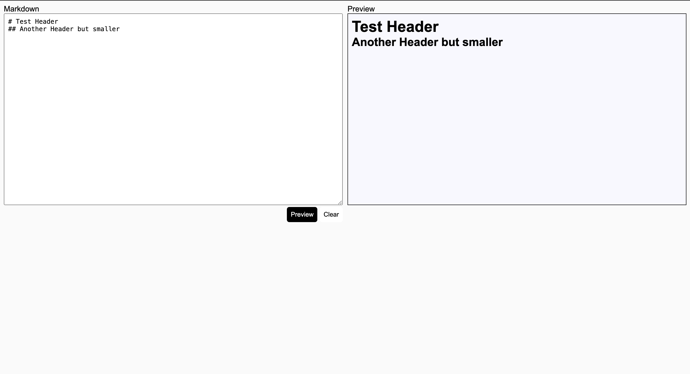

# [Markdown-Preview](https://moviesdiary.xyz): A simple and fast markdown preview tool in the brwoser

## Preview your markdown in the browser in seconds at: [markdownpreview.xyz](https://markdownpreview.xyz)



### Run Locally

```bash
$ git clone "https://github.com/armadi1809/markdown-preview"
$ cd markdown-preview
$ go run main.go
```

### Built With

- [![Golang][Golang]][Golang-url]
- [![HTMX][HTMX]][HTMX-url]

[Golang]: https://img.shields.io/badge/go-%2300ADD8.svg?style=for-the-badge&logo=go&logoColor=white
[Golang-url]: https://go.dev/
[HTMX]: https://img.shields.io/badge/-HTMX-000000?logo=htmx
[HTMX-url]: https://htmx.org/
